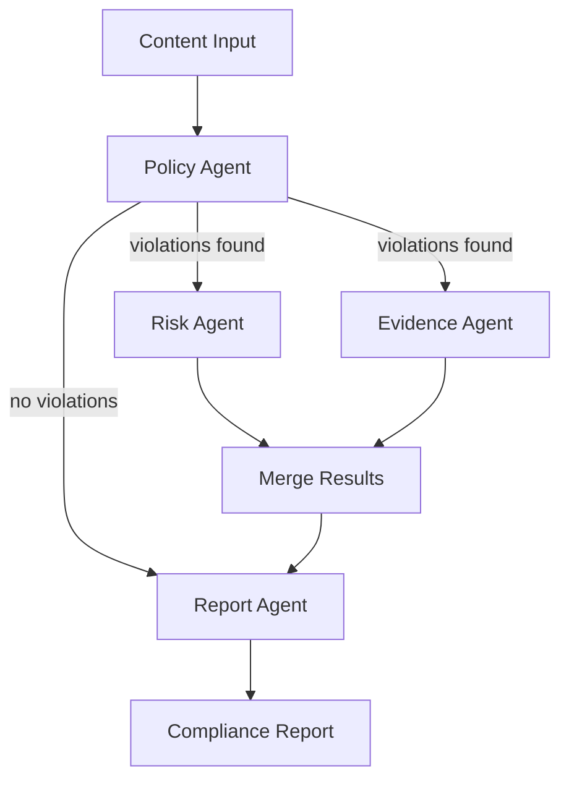

# nim-compliance-agents

[](https://github.com/RemiOunadjela/nim-compliance-agents/actions/workflows/ci.yml)
[](https://www.python.org/downloads/)
[](LICENSE)

**Multi-Agent Compliance Review on NVIDIA NIM** --- a reference architecture for building multi-agent regulatory compliance review systems using NVIDIA NIM for inference and LangGraph for orchestration.

## Why This Exists

Content platforms operating in regulated markets need automated compliance review pipelines that are auditable, extensible, and fast. This project demonstrates how to decompose that problem into specialized agents, each backed by NVIDIA NIM inference, and orchestrate them with a typed state machine.

It is designed as a reference architecture for GSI partners integrating NVIDIA NIM into trust & safety workflows. The patterns here --- provider abstraction, conditional fan-out, typed state contracts --- apply to any multi-agent system, not just compliance.

## Architecture



1. **Policy Agent** classifies content against a regulatory framework (e.g., EU Digital Services Act) and identifies violations.
2. **Risk Agent** and **Evidence Agent** run concurrently when violations are found --- risk scores severity while evidence extracts supporting passages.
3. **Report Agent** synthesizes everything into a structured compliance report.

If the content is clean, the pipeline skips directly from the policy agent to the report agent, producing a fast clean result.

## Quick Start

```bash
# Clone and install
git clone https://github.com/RemiOunadjela/nim-compliance-agents.git
cd nim-compliance-agents
pip install -e ".[dev]"

# Run a review with the mock provider (no API key needed)
nim-compliance review --input examples/sample_content.txt --framework dsa --mock
```

To use NVIDIA NIM for real inference:

```bash
export NVIDIA_API_KEY=your-key-here
nim-compliance review --input examples/sample_content.txt --framework dsa
```

Get an API key at [build.nvidia.com](https://build.nvidia.com).

## CLI Reference

```bash
# Review content
nim-compliance review --input content.txt --framework dsa
nim-compliance review --input content.txt --framework dsa --mock
nim-compliance review --input content.txt --output-format json --output report.json

# List available frameworks
nim-compliance frameworks list
```

## NVIDIA NIM Integration

All LLM calls go through a provider interface (`LLMProvider`), making it trivial to swap inference backends:

```python
from nim_compliance_agents.providers.nim import NIMProvider
from nim_compliance_agents.providers.mock import MockProvider

# Real inference via NVIDIA NIM
provider = NIMProvider()

# Mock for testing / demos
provider = MockProvider()
```

The NIM provider calls the `meta/llama-3.1-70b-instruct` model via `https://integrate.api.nvidia.com/v1/chat/completions` with:

- Async HTTP via `httpx`
- Exponential backoff retry (3 attempts)
- Automatic JSON extraction from model responses
- Configurable model, temperature, and endpoint via environment variables

## LangGraph Orchestration

The pipeline is a `StateGraph` where every node receives and returns a typed `ComplianceState`:

```python
class ComplianceState(BaseModel):
    content: str
    framework: str = "dsa"
    violations: list[Violation] = []
    risk_assessment: Optional[RiskAssessment] = None
    evidence: list[Evidence] = []
    report: Optional[str] = None
    error: Optional[str] = None
```

Conditional edges route based on the policy agent's output:

- **Violations found** --- fan out to risk + evidence agents (concurrent), merge, then report.
- **No violations** --- skip directly to report for a fast clean result.

This avoids unnecessary LLM calls for compliant content while ensuring thorough analysis when violations exist.

## How to Adapt This

### Swap the model

Change `NVIDIA_MODEL` in your environment or `config.py`:

```bash
export NVIDIA_MODEL=meta/llama-3.1-405b-instruct
```

### Add a regulatory framework

Create a YAML file in `nim_compliance_agents/frameworks/`:

```yaml
name: AI Act
abbreviation: AIA
jurisdiction: European Union
version: "2024/1689"
violation_categories:
  - id: prohibited_practice
    name: Prohibited AI Practice
    article: "Article 5"
    description: "Use of AI systems for social scoring or real-time biometric identification"
    severity_baseline: p0
severity_scale:
  p0: "Prohibited practice, must cease immediately"
  p1: "High-risk non-compliance"
```

Then run: `nim-compliance review --input content.txt --framework aia`

### Add a custom agent

Implement the same pattern --- take `ComplianceState`, call the provider, return updated state --- and wire it into the graph in `graph.py`.

### Use a different LLM backend

Implement `LLMProvider.complete()` for your backend (OpenAI, Anthropic, local vLLM, etc.). The agent code does not change.

## Docker

```bash
# Build and run
docker compose up --build

# Or run directly
docker build -t nim-compliance .
docker run --env-file .env nim-compliance review --input /data/content.txt --framework dsa
```

## Testing

```bash
# Run all tests
pytest -v

# Run with coverage
pytest --cov=nim_compliance_agents

# Lint
ruff check nim_compliance_agents/ tests/
```

All tests use the mock provider --- no API key or network access required.

## Design Decisions

**Why separate agents instead of one big prompt?**
Each agent has a focused system prompt optimized for its task. This improves output quality, makes the pipeline auditable (you can inspect each stage), and allows independent iteration on individual agents.

**Why conditional routing?**
Compliant content should not incur the latency and cost of risk scoring and evidence extraction. The conditional edge after the policy agent provides a fast path for clean content.

**Why typed state?**
The `ComplianceState` Pydantic model is the contract between agents. Type validation catches integration bugs at the boundary between stages rather than letting malformed data propagate through the pipeline.

**Why a provider interface?**
Decoupling agents from the inference backend means the same pipeline works with NVIDIA NIM in production, a mock provider in tests, and any future backend without changing agent code.

## Project Structure

```
nim_compliance_agents/
    cli.py              # Click CLI entrypoint
    config.py           # Settings via pydantic-settings
    state.py            # Pydantic state model (the contract)
    graph.py            # LangGraph StateGraph orchestrator
    providers/
        base.py         # Abstract LLMProvider interface
        nim.py          # NVIDIA NIM implementation
        mock.py         # Mock for testing and demos
    agents/
        policy.py       # Policy classification
        risk.py         # Risk severity scoring
        evidence.py     # Evidence extraction
        report.py       # Report synthesis
    frameworks/
        loader.py       # YAML framework loader
        dsa.yaml        # EU Digital Services Act
    output/
        formatter.py    # Markdown + JSON formatting
```

## License

MIT
